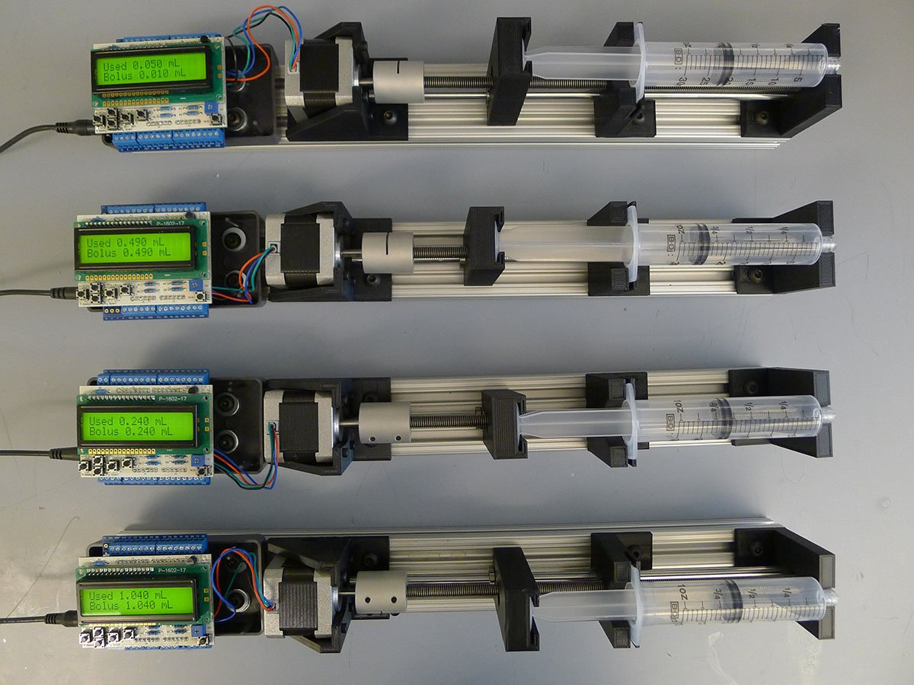
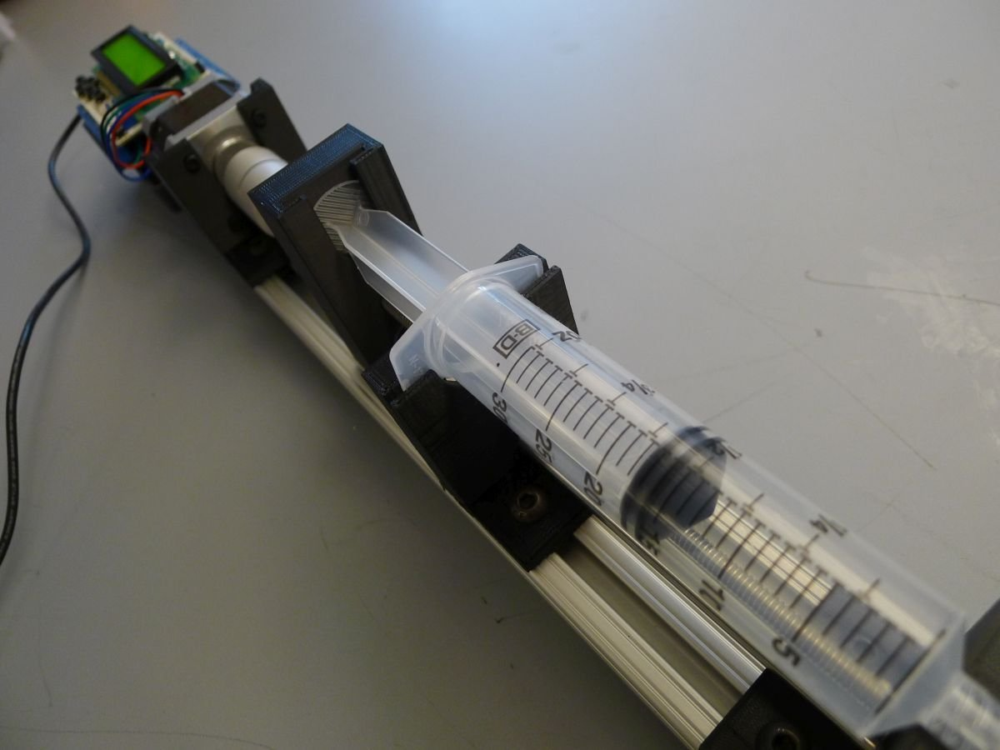
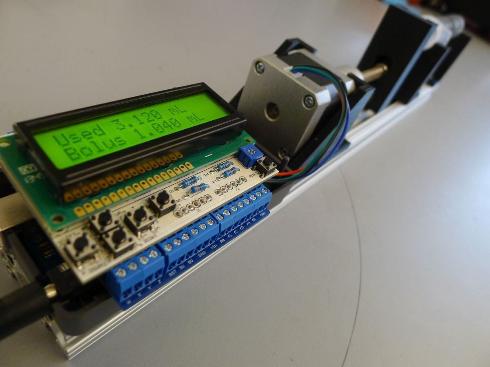

# Open Syringe Pump

Deliver small, accurate amounts of liquid. Good for food engineering, CNCs, and bioscience. Cheaper and more flexible than the $1000+ commercial solutions.

This was the first open-source syringe pump, back when 3D printing and open-source hardware took off circa 2015. It saw practical use in many lab and hobby environments. I personally used it in [animal training experiments](github.com/manimino/ShrewDriver) to deliver juice rewards.

Successors improved on this design substantially. If you're making a new syringe pump, go find a newer design instead. This repo's for legacy reasons now, to support anyone with one of these pumps.

If you want to build one, refer to the [Assembly instructions](instructions.md) and [Electronics + Printing doc](./Syringe%20Pump%20Guide.docx).

## Usage

The face buttons provide manual operation - adjust bolus size and push / pull.

It can be triggered to push and pull liquid via the digital pin inputs, and it accepts more complex commands via serial over USB. 

## Code Layout

'3D files' contains OpenSCAD and STL files for customizing and printing the plastic pieces.

'syringePump' contains the Arduino code.

It requires the AccelStepper library, which you can find in the 'libraries' dir. Copy it into your Arduino\libraries directory to use. You can also get the library from the author's page here: http://www.airspayce.com/mikem/arduino/AccelStepper/

##  Materials

The total cost should come out to about $250 with shipping. So, that's 
substantially cheaper than a commercial syringe pump; they typically go 
for $1000+.

Cost is not the only concern, though. What you get with this thing is:

**- Hackability:** Open-source software and hardware all the way. Customize the hardware and software to do anything you need.

**- Modularity:** You can swap out each component for another one of your choosing. Exceptions and concerns noted below.

**- Extendability:** Want to add [Ethernet]http://arduino.cc/en/Main/ArduinoEthernetShield) or [Bluetooth]http://www.adafruit.com/product/1628)? Both shields are compatible, just stack them on. This [SD card shield]https://www.adafruit.com/product/1141) is compatible too if you want to add data logging. 

**- Ease of assembly:** Minimal soldering required, and tutorials + vendor support are available for most components.

**- Availability of components:**
 Everything's off-the-shelf from stable sources (Adafruit, SparkFun, 
Amazon, McMaster-Carr). If you're in the US, all parts should arrive in 
well under two weeks.

## Electronic Components:

| Purpose                          | Product Link                                                               | Vendor   | Cost (not including shipping) | Notes                                                                                                                      |
|----------------------------------|----------------------------------------------------------------------------|----------|-------------------------------|----------------------------------------------------------------------------------------------------------------------------|
| Microcontroller                  | Arduino Uno R3                                                             | Adafruit | $24.95                        | --                                                                                                                         |
| Stepper Motor                    | NEMA 17 stepper motor, 12V, 1.3A, Holding Torque 40N*cm. Model 42HS4013A4. | Adafruit | $18.50                        | Plenty of power for pushing even thick liquids.                                                                            |
| Stepper Motor Driver             | Big Easy Driver                                                            | Sparkfun | $14.95                        | Attach to digital pins 2 and 3.                                                                                            |
| User Interface Shield            | LCD button shield                                                          | Sparkfun | $12.95                        | Uses digital pins 4 through 9.                                                                                             |
| Power Source                     | 24V 1A power supply                                                        | Jameco   | $11.95                        | --                                                                                                                         |
| Power Switch                     | Inline Power Switch                                                        | Adafruit | $2.50                         | --                                                                                                                         |
| Power Jack                       | Terminal Power Jack                                                        | Adafruit | $2.00                         | --                                                                                                                         |
| Enclosure                        | Arduino Project Enclosure                                                  | Amazon   | $8.95                         | Fits nicely to the Arduino and to the aluminum rail. Only the bottom half is used.                                         |
| Trigger Inputs & Driver Mounting | Proto-Screwshield (Wingshield) R3 Kit for Arduino                          | Adafruit | $14.95                        | A convenient way to expose digital pins so you can send triggers to the syringe pump. Also fits the Easy Driver perfectly. |

## Mechanical Components:

| Purpose                               | Product Link                                                   | Vendor         | Cost (not including shipping) | Notes                                                                                                                                                           |
|---------------------------------------|----------------------------------------------------------------|----------------|-------------------------------|-----------------------------------------------------------------------------------------------------------------------------------------------------------------|
| Mounting Rail                         | 18-inch piece of 1"x2" 80/20 extruded aluminum rail.           | Amazon         | $8.97                         | Mounting everything on the rail makes the project modular and space-efficient. And the 18" length means your syringe pump will fit into most rack mount setups. |
| Motor mount                           | STL + SCAD file (GitHub)                                       |                | --                            | 3D printed                                                                                                                                                      |
| Syringe plunger attachment            | STL + SCAD file (GitHub)                                       |                | --                            | 3D printed                                                                                                                                                      |
| Syringe barrel holder                 | STL + SCAD file (GitHub)                                       |                | --                            | 3D printed                                                                                                                                                      |
| Syringe tip holder                    | STL + SCAD file (GitHub)                                       |                | --                            | 3D printed                                                                                                                                                      |
| Nuts and bolts for attaching to 80/20 | 80/20 Attachment Nuts and Bolts, Economy, 25-pack              | Amazon         | $10.00                        | Cheap and effective.                                                                                                                                            |
| Shaft coupler                         | 5mm - 8mm Rigid Coupling 25x30mm For CNC Stepper Motor ST-RC03 | Stepper Online | $7.47                         | Attaches the stepper motor to the threaded rod.                                                                                                                 |
| Threaded Rod                          | M8 Threaded Rod, Type 316 Stainless Steel, 1m length           | McMaster-Carr  | $14.72                        | Comes as a 1m stick. You'll want to cut this down to around 300mm. There are many ways to do this; I used a chop saw.                                           |
| M8 Nut for Threaded Rod               | M8 Nut, Type 316 Stainless Steel, 50-pack                      | McMaster-Carr  | $13.38                        | --                                                                                                                                                              |
| Smooth rod                            | 8mm rod, 330mm long                                            | Amazon         | $13.39                        | --                                                                                                                                                              |
| Linear Bearing                        | LM8UU 12-pack                                                  | Amazon         | $13.00                        | --                                                                                                                                                              |
| Syringe                               | 30mL syringe 5-pack                                            | Amazon         | $7.99                         | --                                                                                            
